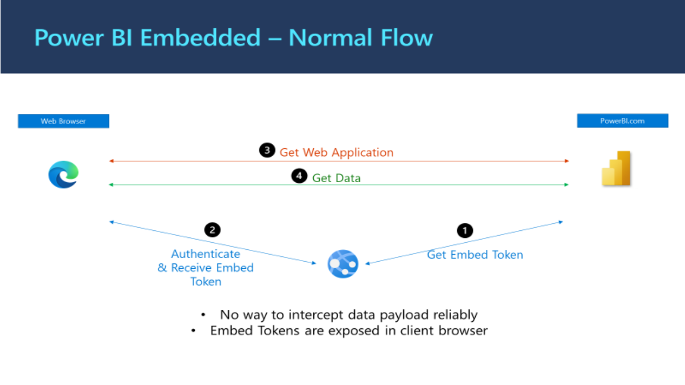
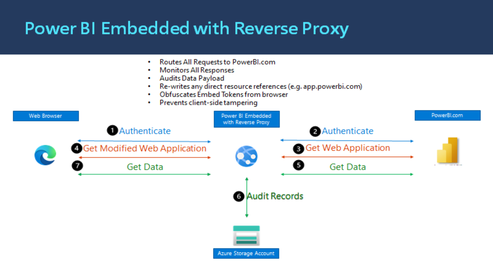
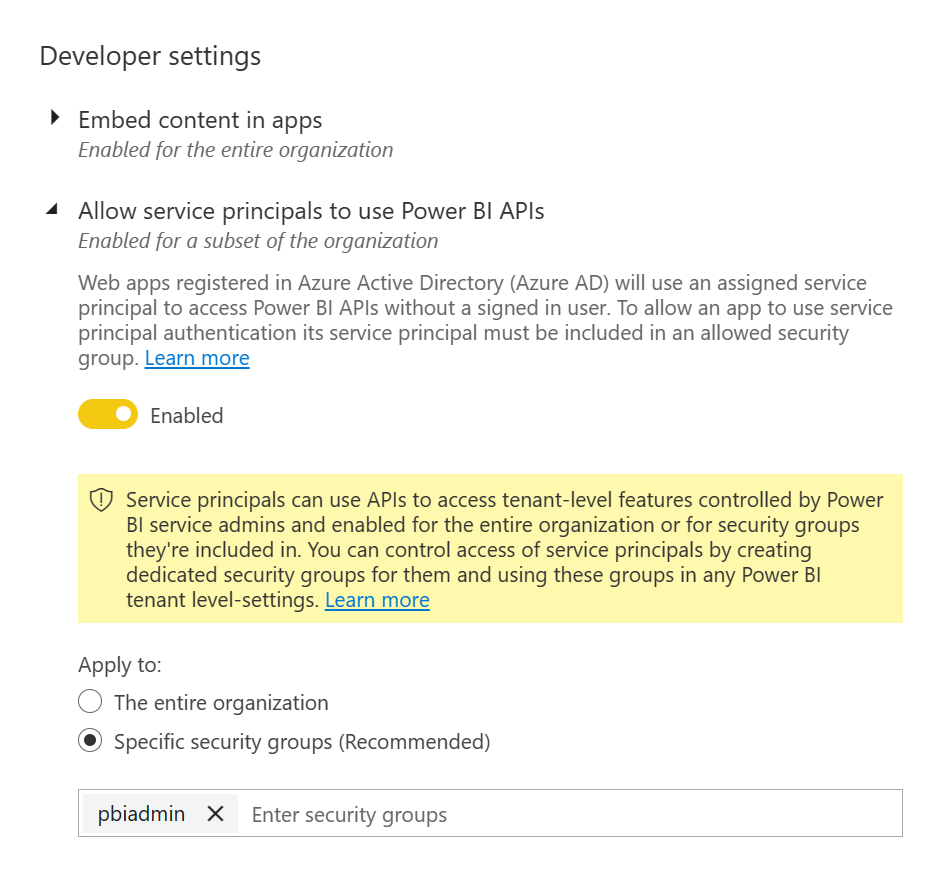

# Power BI Data Access Auditing 
## Introduction
This repository provides a sample, proof of concept (POC), application that is designed to demonstrate how an organisation might implement Auditing of Power BI data viewed by its users. 

The POC extends on the default functionality provided by Power BI Embedded by adding a reverse proxy that effectively allows the server side code of the application to broker all communication between the client side application and the Power BI endpoints. Figure 1 below shows the normal flow of information when using standard Power BI Embedded. Figure 2 illustrates how this POC application extends this flow and implements its auditing functionality.

### Figure 1 

### Figure 2

## Deployment

### Pre-Requisites
1. **Repository Fork (RF)**: Create a fork of this repository. 
1. **Resource Group (RG)**: Create a Resource Group within your Azure environment that will host the POC. 
2. **Deployment Service Principal (DSP)**: Create a service prinicpal that will be used to with Contributor Rights on the RG created in the step above. Store the 
3. **Authorisation Service Principal (ASP)**:
4. **Power BI Service Principal Security Group (PBISPSG)**: Create an new Azure AD security group. This security group will contain all Service Principal Accounts that will be allowed to use your Power BI service APIs.
4. **Power BI Access Service Principal (PBIASP)**: Create a service principal that will be used by the POC application to access Power BI content within your Power BI environment. Add this service prinicapl to the PBISPSG that you created in the previous step.
5. **[Power BI Admin Settings](https://docs.microsoft.com/en-us/power-bi/admin/service-admin-portal)**: Access the Power BI Admin Portal and add the PBISPSG to list of groups allowed to use Power BI APIs (see image below for an example)

## Contributing

This project welcomes contributions and suggestions.  Most contributions require you to agree to a
Contributor License Agreement (CLA) declaring that you have the right to, and actually do, grant us
the rights to use your contribution. For details, visit https://cla.opensource.microsoft.com.

When you submit a pull request, a CLA bot will automatically determine whether you need to provide
a CLA and decorate the PR appropriately (e.g., status check, comment). Simply follow the instructions
provided by the bot. You will only need to do this once across all repos using our CLA.

This project has adopted the [Microsoft Open Source Code of Conduct](https://opensource.microsoft.com/codeofconduct/).
For more information see the [Code of Conduct FAQ](https://opensource.microsoft.com/codeofconduct/faq/) or
contact [opencode@microsoft.com](mailto:opencode@microsoft.com) with any additional questions or comments.

## Trademarks

This project may contain trademarks or logos for projects, products, or services. Authorized use of Microsoft 
trademarks or logos is subject to and must follow 
[Microsoft's Trademark & Brand Guidelines](https://www.microsoft.com/en-us/legal/intellectualproperty/trademarks/usage/general).
Use of Microsoft trademarks or logos in modified versions of this project must not cause confusion or imply Microsoft sponsorship.
Any use of third-party trademarks or logos are subject to those third-party's policies.
